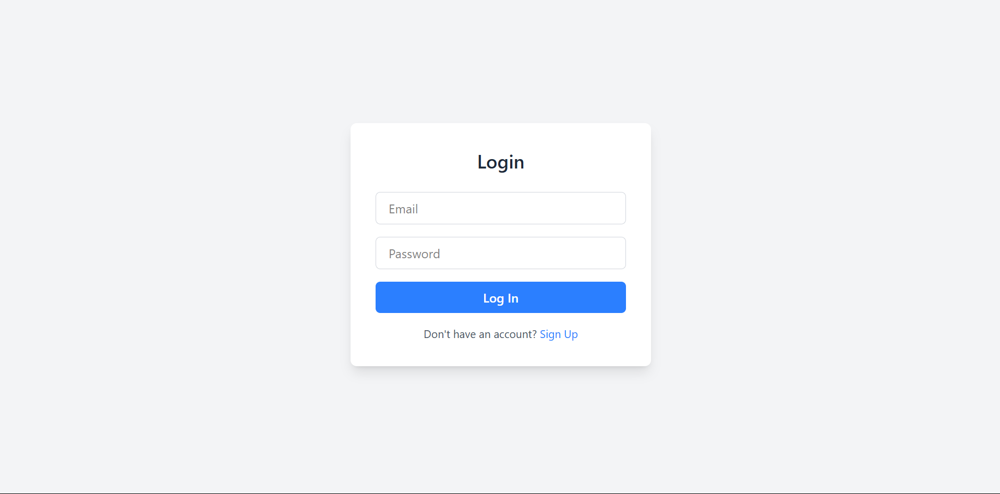
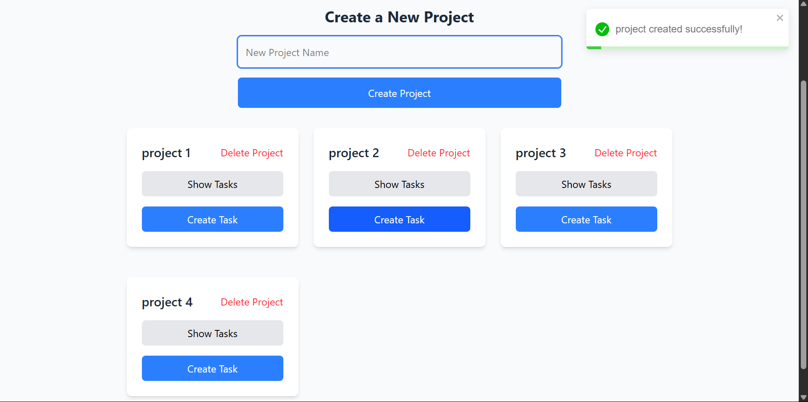
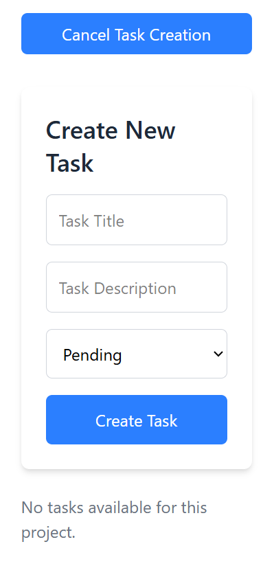

# 🗂️ Task Tracker Web App

A full-stack Task Tracker application built with **React**, **Express.js**, and **MongoDB**. It allows users to register, log in, manage projects, and create/update/delete tasks under each project.

> 🔐 Authenticated using **JWT tokens**, with secure session storage.

---

## 📸 Demo Screenshots

| Login Page | Dashboard | Create Task |
|------------|-----------|-------------|
|  |  |  |

> ⚠️ Make sure to add these screenshots to `/assets` folder in your GitHub repo or use image links.

---

## 🚀 Features

- 🔐 **Authentication** (JWT based)
- 👥 **User Management**
- 📁 **Create / Delete Projects**
- ✅ **Add, Update, Delete Tasks per Project**
- 🎨 **Modern UI** with TailwindCSS
- 💾 **Persistent Login** using localStorage
- 📝 Real-time **task status updates**
- 📦 Clean folder structure and modular components

---

## 📂 Tech Stack

| Frontend       | Backend          | Database |
|----------------|------------------|----------|
| React + Tailwind | Node + Express    | MongoDB  |

---

## 🛠️ Installation & Running Locally

### 📌 Prerequisites

- Node.js ≥ 16.x
- MongoDB running locally or cloud (MongoDB Atlas)
- Git

### 🔧 Backend Setup (`/backend`)

```bash
cd backend
npm install
# Add .env file with the following:
# PORT=5000
# MONGO_URI=your_mongodb_uri
# JWT_SECRET=your_jwt_secret

nodemon server.js


### 🔧 Frontend Setup (`/frontend`)

```bash
cd frontend
npm install

npm run dev
